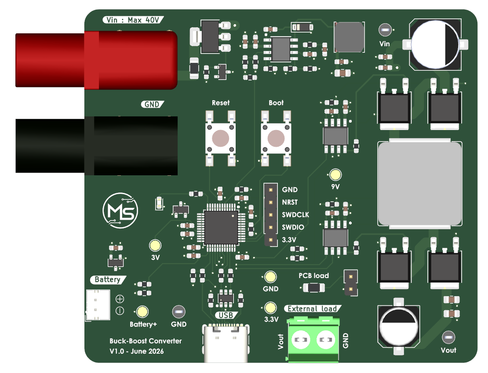
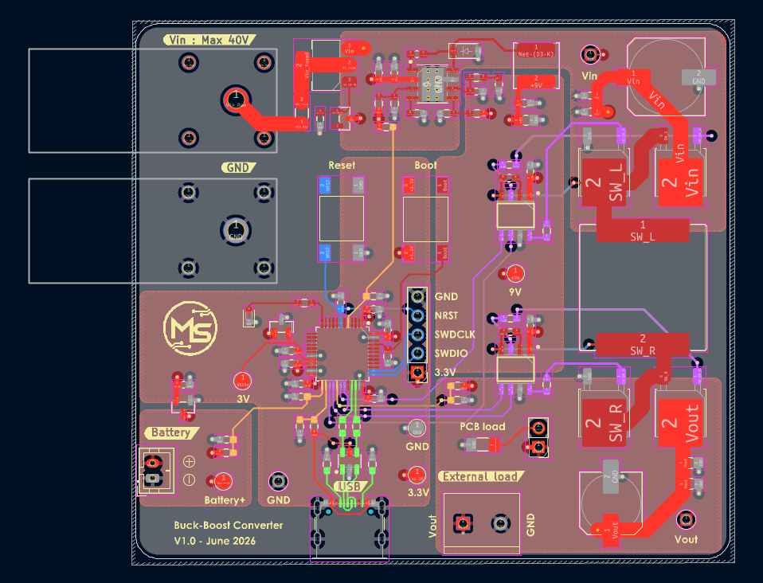
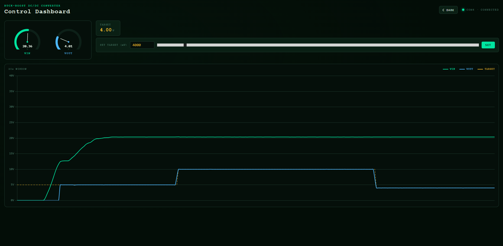

# Buck-Boost DC/DC Converter

A 4-switch synchronous buck-boost converter built around an STM32G431CBT6, with a digital PI control loop, USB CDC telemetry, and a real-time web dashboard for monitoring and control.

## Overview

This project implements a 4-switch buck-boost DC/DC converter. The STM32 runs a 300 kHz PWM control loop with real-time voltage sensing, feedforward + PI regulation, soft-start, and software UVLO protection. A companion web dashboard connects over USB to display live VIN/VOUT readings and lets you adjust the output setpoint from a browser.

**Key specifications**

| Parameter        | Value              |
|-------------------|-------------------|
| Input voltage     | 10 – 40 V          |
| Output voltage    | 3 – 15 V           |
| Max output current| 3 A                |
| Switching frequency | 300 kHz          |
| MCU               | STM32G431CBT6 (Cortex-M4, 170 MHz) |
| Topology          | 4-switch buck-boost |

## Features

- Digital PI control with feedforward
- Soft-start on power-up and on setpoint changes
- Software UVLO (on: 12 V, off: 10 V) backed by a hardware UVLO on the gate-driver supply
- Dual-simultaneous ADC sampling of VIN and VOUT, triggered by the timer
- USB CDC telemetry (VIN, VOUT, target, duty cycle)
- Web dashboard (Python/WebSocket backend + HTML/JS frontend) for live plotting and setpoint control
- State-machine firmware architecture designed to be extended to boost and full buck-boost modes

## Hardware



The converter uses four N-channel MOSFETs driven by two half-bridge gate drivers.



See [`hardware/kicad`](hardware/kicad) for the full KiCad project and [`hardware/bom`](hardware/bom) for the bill of materials.

## Firmware

See [`firmware/`](firmware) for the STM32CubeIDE project.

### Building

1. Open the project in STM32CubeIDE (`firmware/DC-DC-Converter.ioc`)
2. Build and flash to an STM32G431CBT6
3. Connect over USB

## Dashboard



The dashboard connects to the board's virtual COM port and streams VIN/VOUT/target data to a browser in real time over a local WebSocket, with a live waveform plot and a setpoint control.

### Running it

```bash
cd dashboard
pip install pyserial websockets
python server.py
```

Then open `index.html` in a browser. Update the `PORT` variable in `server.py` to match your board's COM port.
